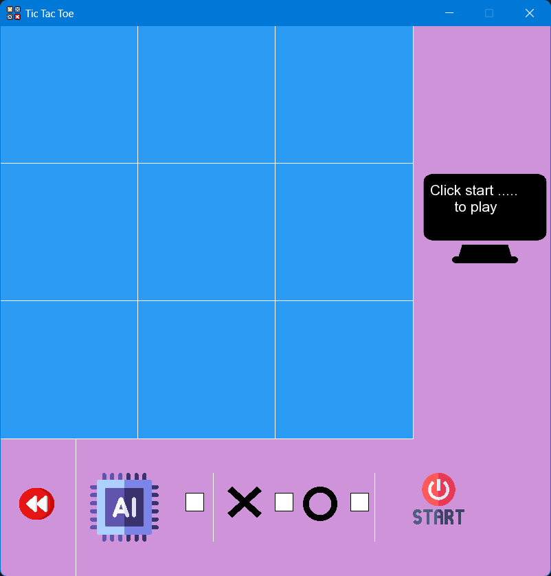
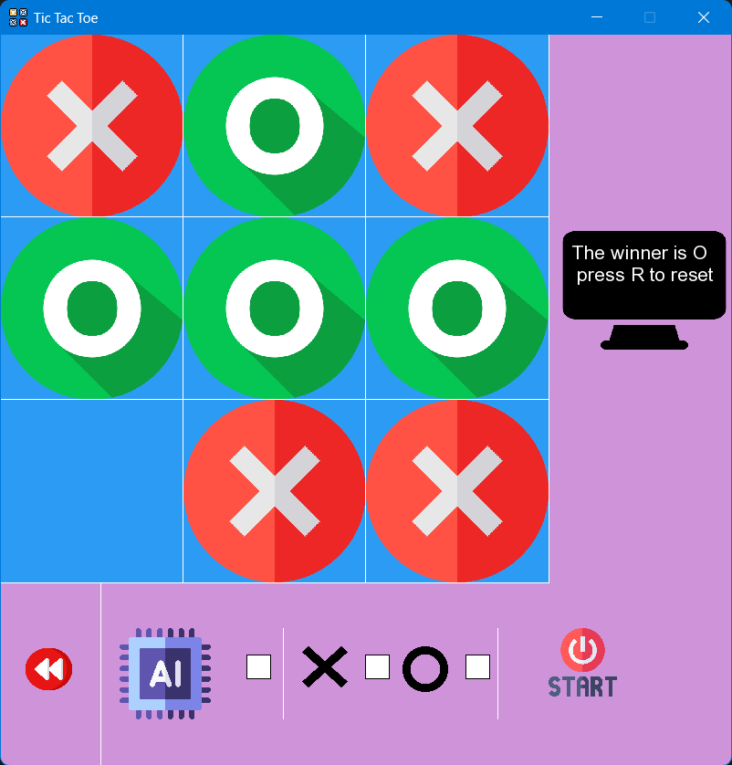
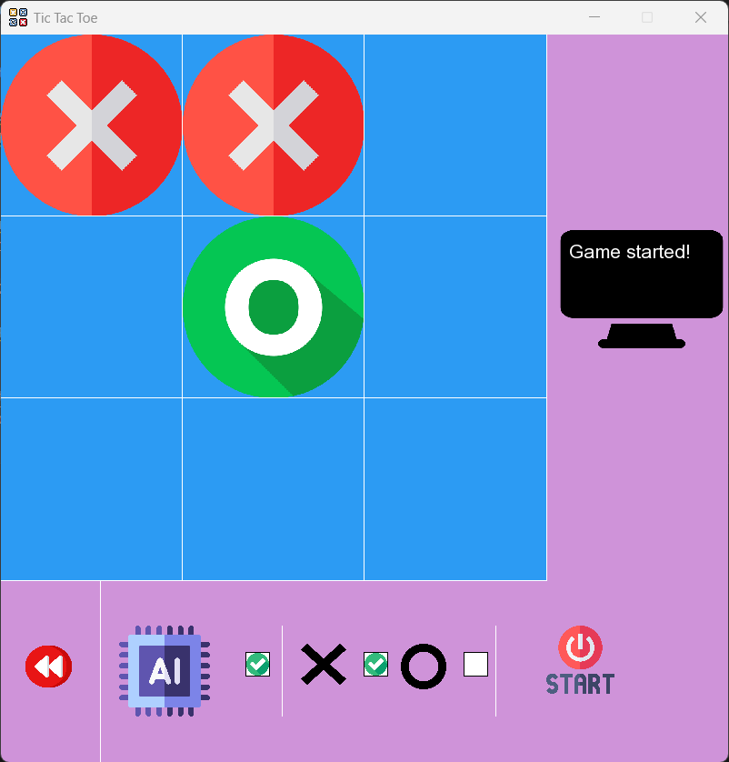

# Tic Tac Toe (C++ & SFML)

A simple yet feature-rich **Tic Tac Toe game** built with **C++20 modules** and **SFML**.  
Play against another human or challenge the AI that can sometimes surprise you with clever (and sometimes silly 😅) moves.

---

## Features
-  **Two-player mode** (human vs human)  
-  **AI mode** (human vs AI)  
-  **Undo support** (only for two human players, disabled in AI mode)  
-  **Custom UI** built from scratch in SFML  
-  **Sound effects** for clicks, wins, and ties  
-  **Game reset** via a keypress R and start button (no accidental board updates after game over)  

---

##  Tech Stack
- **Language:** C++20 (modules)  
- **Graphics/UI:** SFML 3.0 
- **AI:** Minimax  
- **Build system:** (CMake / g++ / MSVC — depending on what you used)  

---

## Getting Started

### Prerequisites
- Install [SFML](https://www.sfml-dev.org/) (>= 3.0)  
- A C++20 or greater compatible compiler (GCC 11+, Clang 13+, MSVC 2022)  


## Sample Screenshot






### Build & Run
```bash
# Clone this repo
git clone https://github.com/MaximilianIsidore/Tic-Tac-Toe.git
cd Tic-Tac-Toe

makdir build
cd build

cmake --build cmake --build . --config Release


# Run
./bin/Release/Tic-Tac-Toe.exe

# OR you can just install the app from the release tab
```

## Credits
-  **Icons** from [Flaticon](https://www.flaticon.com/)  
-  **Music & sound effects** from [OpenGameArt](https://opengameart.org/) 